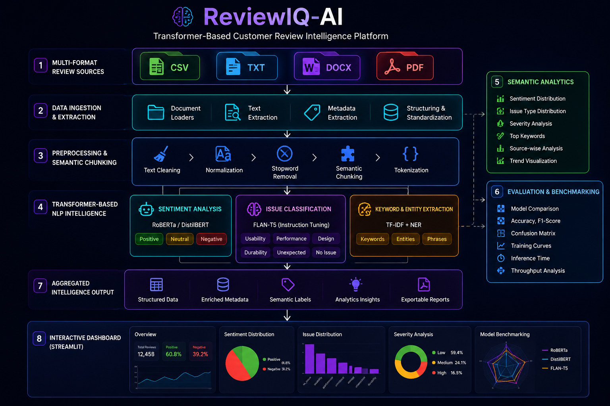
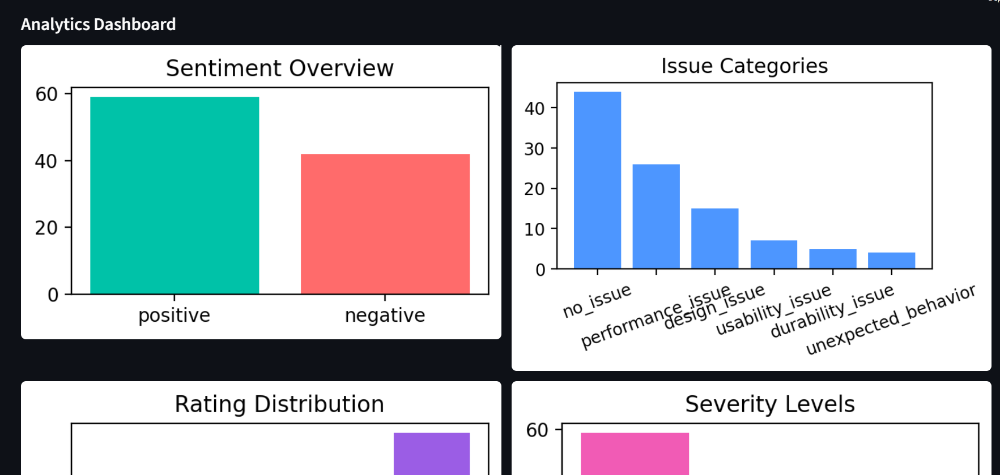
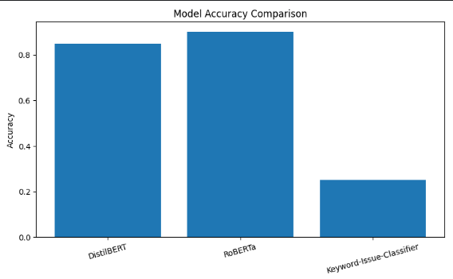
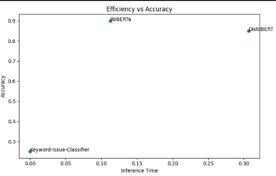
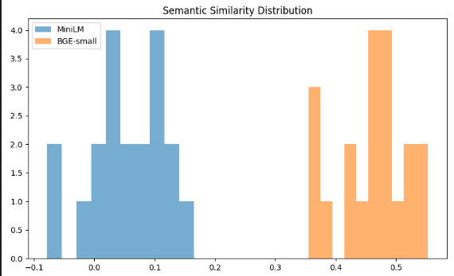

# Multi-Format Customer Review Intelligence using Transformer-Based NLP


---

## Overview

This project presents a Transformer-based Natural Language Processing framework for intelligent analysis of customer reviews collected from multiple document formats including CSV, TXT, DOCX, and PDF files.

The system automatically extracts review information, performs sentiment analysis, identifies issue categories, determines severity levels, extracts keywords, and generates structured analytics dashboards for business intelligence applications.

Unlike conventional review mining systems, the proposed framework supports multi-format document ingestion and combines rule-based extraction with transformer-based language models to provide deeper semantic understanding of customer feedback.

---

## System Architecture

<p align="center">
  
</p>

The pipeline consists of:

1. Multi-format document ingestion
2. Text preprocessing and chunking
3. Metadata extraction
4. Sentiment analysis
5. Issue classification
6. Severity estimation
7. Keyword extraction
8. Dashboard generation
9. Model evaluation and benchmarking

---

## Features

### Multi-Format Document Support

* CSV Reviews
* TXT Reviews
* DOCX Reports
* PDF Documents

### NLP Analytics

* Sentiment Analysis
* Issue Classification
* Severity Detection
* Keyword Extraction
* Metadata Identification

### Interactive Dashboard

* Sentiment Distribution
* Issue Type Analysis
* Severity Trends
* Keyword Frequency Analysis
* Source-wise Statistics

### Model Benchmarking

Comparison of:

* DistilBERT
* RoBERTa
* FLAN-T5

using:

* Accuracy
* Precision
* Recall
* F1 Score
* Inference Time

---

## Dashboard Results

<p align="center">
  
</p>

The dashboard provides a visual summary of customer feedback trends, sentiment distributions, issue categories, severity levels, and frequently occurring keywords.

---

## Model Comparison

<p align="center">
  
</p>

Transformer models were benchmarked using a manually annotated ground-truth dataset.

### Observations

| Model      | Accuracy    | Strength                        |
| ---------- | ----------- | ------------------------------- |
| RoBERTa    | Highest     | Best sentiment classification   |
| DistilBERT | Competitive | Fast inference                  |
| FLAN-T5    | Moderate    | Generative reasoning capability |

RoBERTa achieved the highest classification performance while DistilBERT provided a strong balance between accuracy and computational efficiency.

---

## Accuracy vs Efficiency Trade-off

<p align="center">
  
</p>

This comparison highlights the trade-off between prediction accuracy and inference latency.

Key findings:

* RoBERTa delivered the highest accuracy.
* DistilBERT achieved the fastest execution.
* FLAN-T5 required greater computational resources.

---

## Semantic Similarity Analysis

<p align="center">
  
</p>

Embedding-based semantic similarity experiments were conducted using Sentence Transformers.

Models evaluated:

* MiniLM
* BGE-Small

Results demonstrated that BGE-Small generated stronger semantic representations and achieved higher similarity consistency across review samples.

---

## Installation

Clone the repository:

```bash
git clone https://github.com/yourusername/Multi-Format-Customer-Review-Intelligence.git

cd Multi-Format-Customer-Review-Intelligence
```

Install dependencies:

```bash
pip install -r requirements.txt
```

---

## Run the Application

Launch the Streamlit interface:

```bash
streamlit run app.py
```

Open:

```text
http://localhost:8501
```

Upload review files and generate analytics automatically.

---

## Technologies Used

* Python
* Streamlit
* Pandas
* Transformers
* HuggingFace
* Scikit-Learn
* Sentence Transformers
* Matplotlib
* Seaborn

---

## Author

Ananya
